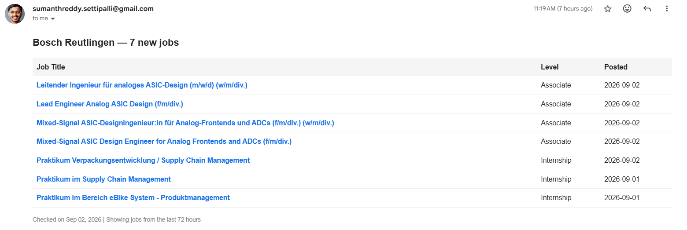

# smartrecruiters-job-alerts

One email a day with the jobs that appeared since yesterday, from any employer
hosted on SmartRecruiters. Python + GitHub Actions cron. No server, no API key,
no scraping.

[](https://github.com/Sumanthreddy-DE/smartrecruiters-job-alerts/actions/workflows/test.yml)



That's a real digest. This ran every morning for five months, filtering Bosch
Reutlingen down to student and graduate roles posted in the last 72 hours.

## The problem

Careers portals show you every open role. They don't show you what's *new*. So you
open the same page every morning, scan a list you mostly recognise, and hope you
spot the two rows that weren't there yesterday. Postings fill up in days, so
checking weekly is too slow — and checking daily by hand is tedious enough that
you quietly stop after a week.

This inverts it: nothing to open, one mail a day, and if there's nothing new it
says so.

## How it works

**1 — Fetch.** One GET against the SmartRecruiters public API. No auth, no key,
documented, rate-limited at 10 req/s (this uses one):

```
GET https://api.smartrecruiters.com/v1/companies/BoschGroup/postings
    ?country=de&city=Reutlingen&limit=100
```

**2 — Filter.** Keep a posting only if its `experienceLevel.id` is in the allowed
set (`internship`, `entry_level`, `associate`, `not_applicable` — which is how
SmartRecruiters encodes Praktikum, Werkstudent, Thesis and PreMaster roles), its
`releasedDate` falls inside the 72-hour window, and its title matches a keyword if
any are configured. Sort newest first.

**3 — Email.** Build an HTML table — title as a link to the posting, level, date —
and send it through Gmail SMTP with `smtplib`. An empty result still sends a
"no new jobs" mail: a silent inbox looks the same whether nothing was posted or
the workflow has been broken all week.

**4 — Schedule.** GitHub Actions cron at 05:00 UTC daily, plus `workflow_dispatch`
so you can trigger a run by hand and check your inbox.

The window (72h) is deliberately wider than the interval (24h), so a failed run
isn't a gap — the next day's mail still covers what the missed one would have.
Reasoning behind that and the other choices is in [docs/DESIGN.md](docs/DESIGN.md).

## Quickstart

1. **Fork** this repo.
2. **Enable Actions** on the fork. GitHub disables workflows on forks by default —
   open the Actions tab and confirm once, or nothing will ever run.
3. **Add two secrets** under Settings → Secrets and variables → Actions:
   - `GMAIL_ADDRESS` — the account that sends *and* receives the digest
   - `GMAIL_APP_PASSWORD` — see [below](#gmail-app-password)
4. **Edit `CONFIG`** at the top of `main.py` to point at your employer and city.
5. **Actions → Bosch Job Alerts → Run workflow.** Check your inbox, then let the
   cron take over.

Running it locally is the same two variables:

```bash
pip install -r requirements.txt
GMAIL_ADDRESS=you@gmail.com GMAIL_APP_PASSWORD=abcd... python main.py
```

## Pointing it at another employer

Everything lives in one dict at the top of `main.py`. Swapping targets is a diff,
not a rewrite — here it is moving from Bosch Reutlingen to Bosch Stuttgart:

```diff
 CONFIG = {
     "company": "BoschGroup",
     "country": "de",
-    "city": "Reutlingen",
+    "city": "Stuttgart",
     "hours_window": 72,
     "experience_levels": ["internship", "entry_level", "associate", "not_applicable"],
     "keywords": [],
 }
```

For a different company, change `company` (and `JOB_LINK` on the next line, which
builds the click-through URLs):

```diff
-    "company": "BoschGroup",
+    "company": "SomeOtherEmployer",
-    "country": "de",
+    "country": "fr",
-    "city": "Reutlingen",
+    "city": "Paris",
     "hours_window": 72,
-    "experience_levels": ["internship", "entry_level", "associate", "not_applicable"],
+    "experience_levels": ["mid_senior_level", "director"],
-    "keywords": [],
+    "keywords": ["software", "data", "embedded"],
 }

-JOB_LINK = "https://jobs.smartrecruiters.com/BoschGroup"
+JOB_LINK = "https://jobs.smartrecruiters.com/SomeOtherEmployer"
```

| Field | What it is |
|---|---|
| `company` | The slug in the employer's careers URL: `jobs.smartrecruiters.com/`**`BoschGroup`**. Case-sensitive. |
| `country` | ISO 3166-1 alpha-2, lowercase — `de`, `fr`, `us`. |
| `city` | Must match how the employer spells it in the posting, not your spelling. |
| `hours_window` | Lookback in hours. Keep it wider than your cron interval. |
| `experience_levels` | Any of `internship`, `entry_level`, `associate`, `mid_senior_level`, `director`, `executive`, `not_applicable`. |
| `keywords` | Case-insensitive substring match on the job title. Empty list = no title filtering. |

**Check your slug before you commit it.** An unknown company returns `200 OK` with
an empty result, not a 404 — so a typo looks exactly like an employer with no
openings:

```bash
curl -s "https://api.smartrecruiters.com/v1/companies/BoschGroup/postings?limit=1"
# {"offset":0,"limit":1,"totalFound":4791,...}   <- slug is good
```

A non-zero `totalFound` means the slug resolves. Then add `&country=..&city=..`
to confirm the location filter matches something before you wait a day for an
empty digest.

## Gmail App Password

Google stopped accepting account passwords over SMTP in May 2022, so your normal
password will fail authentication. You need an App Password:

1. Turn on 2-Step Verification on the Google account.
2. Generate a password at [myaccount.google.com/apppasswords](https://myaccount.google.com/apppasswords).
3. Use the 16-character value as `GMAIL_APP_PASSWORD`. Strip the spaces.

The digest is sent from the account to itself, which is why one address covers
both `From` and `To`. This suits a personal digest and nothing larger — see
[docs/DESIGN.md](docs/DESIGN.md) for when to swap the transport out.

## Tests

The filter logic is covered end to end — window boundary, experience levels,
keyword matching, missing and malformed dates, ordering. No network: every posting
is a fixture.

```bash
pip install -r requirements-dev.txt
pytest -q
```

## Design notes

[docs/DESIGN.md](docs/DESIGN.md) — why the public API over scraping, why a time
window instead of tracking seen postings, why Gmail SMTP over SendGrid or SES, why
Actions over a VPS cron, and what the design deliberately doesn't handle.

## License

MIT — see [LICENSE](LICENSE).
